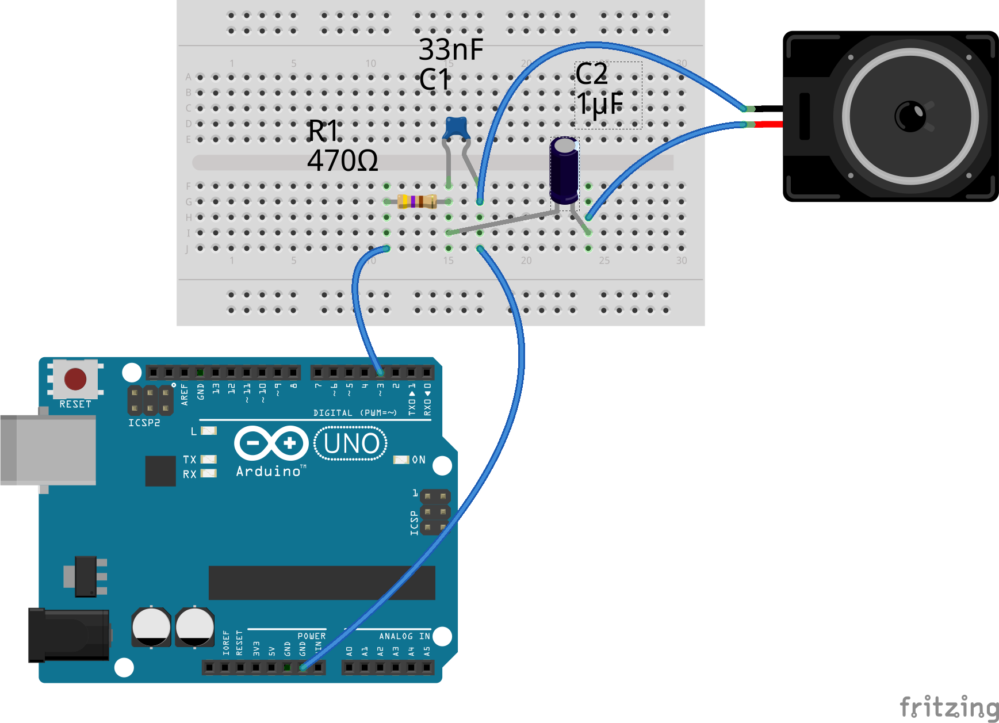

Android Synthesizer - v0.1
==========================

This project implements a working MIDI software synthesizer for the
Arduino UNO (ATMEGA328P). Sound is generated on either pin 3 or pin
11 using the built-in PWM at it's maximum frequency of 62.5 kHz. The PWM value
is updated every 5th PWM cycle so the sampling frequency is pinned down
to 12.5 kHz.

But this is enough to play simple tunes like Yankee Doodle Dandy or the
Super Mario theme. There are three examples included which are ready to
get downloaded on your Arduino. Those examples have been converted from
MIDI files.

Hardware
--------

The whole external circuitry you need is as shown in the following picture.

It should theoretically be possible to connect a headphone directly to pin
3 or 11 and GND without ANY electrical component. But I strongly advise
against this as it could possible damage your Arduinos output stage!!! Try
at your own risk.

The shown parts create a low pass filter at about 10 kHz and a capacitive
coupling to the speaker/headphone/line-out.

As the output pin has a very limited current source capability you will most
probably need an additional amplifier stage, connect it to some active
speakers or connect it to the line-in of the amplifier of your home stereo.

Software
--------

The complete audio synthesizing task runs in the background. After calling
the "play" method you can do whatever your application should do. You can
poll the "Synth" object whether playing has finished.

When I started this project I believed there would be no software synthesizer
for the Arduino. I just saw some people on youtube who used three/four of the
PWMs at audio-level frequencies (20 Hz .. 15 kHz) and via an analog mixing
circuitry or using a resistor-ladder DAC. Arduino-Synth internally does
digital mixing of the channels being played.

As already mentioned playing music is quite easy. In fact there are only
two methods you have to use:

 * Synth.init(byte pinNumber): Call this method in your "setup" routine and
   pass it the pin number on which you want to output the music. Currently
	only pins 3 and 11 are supported

 * Synth.play(SYNTH\_TRACK \*tracks, byte trackCount, word samplesPerTick): 
   This method is responsible for starting the melody. You pass it the
	"tracks" pointer. Note that the music is stored in the Arduino program
	memory. You have to adjust the "trackCount" variable to the number of
	tracks in your array. The "samplesPerTick" parameter defines the speed
	at which your tune is played. The higher the value the slower the music
	will play.

Usually the MIDI file converter in the "resources/scripts" directory
will try to determine the correct play speed from within the MIDI file.
If this is not possible you will have to try some values yourself.
Values between 20 and 100 are a good start.

If your are interested in how the whole stuff works do not fear to look at
Synth.h and Synth.cpp. I tried to create a lot of **inline code documentation**
so the code is readable and understandable.

Music
-----

The main intention for starting this project was my little son Jakob. I wanted
to play some simple child-song tunes to him from an Arduino. Most of those
easy to play songs are available as MIDI files. And as I know quite some stuff
about digital signal processing I started this project. But please note that
I am rather anything than a musician. I like to listen to music but I am not
really able to play an instrument - except eventually a piano :)

There is a script "midi.php" in the "resources/scripts" folder of this
project. It is currently not written very nice but be invited to help
me improve. The script works for simple MIDI files and it will output
a complete Arduino sketch to stdout.

Many MIDI files also features a drum track. Those tracks won't sound very
nice when combined with the music tracks. So you will have to experiment
a little bit and eventually remove one or another track from the final
"SYNTH\_TRACK" array which gets passed to the "play" method.

In the "scripts" directory is also a script for re-generating the sine
table and the MIDI note frequency/period tables.

Additionally there is a "synt.c" program which can get compiled under Linux.
It allows to test the concept of the synthesizer directly on a PC without
the need for an Arduino. See inline code documentation.

Alternatives
------------

While developing the project I found out about "Squeak" which is part of the
Arduino robot library. This project is similar to mine - yet it is even more
advanced as a note does not only get played by starting and stopping a sine
wave but it also allows to apply effects like:

 * [Arpeggio](https://en.wikipedia.org/wiki/Arpeggio)
 * [Glissando](https://en.wikipedia.org/wiki/Glissando)
 * [Portamento](https://en.wikipedia.org/wiki/Portamento)
 * [Tremolo](https://en.wikipedia.org/wiki/Tremolo)
 * [Vibrato](https://en.wikipedia.org/wiki/Vibrato)

One of the major differences is that my application is rather intended to
play MIDI files on the Arduino while "Squeak" requires the songs to be
written in a ProTracker compatible style.

